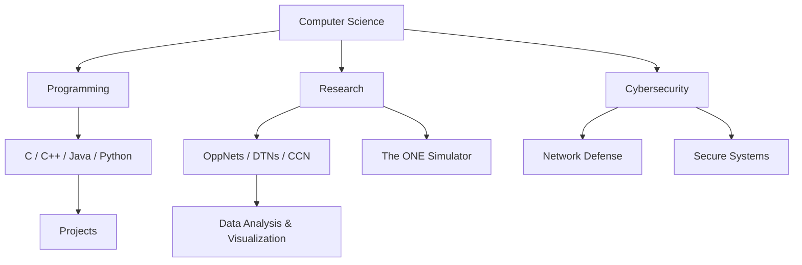

<div align="center">


<p>
  
</p>

<p>
  
  
  
</p>

<p>
  <a href="mailto:pulok519@gmail.com"></a>
  <a href="https://www.linkedin.com/in/pulok-akibuzzaman-73a21229a/" target="_blank"></a>
  <a href="https://github.com/Pulok-Akibuzzaman" target="_blank"></a>
  <a href="https://www.youtube.com/@phantombd09" target="_blank"></a>
</p>

</div>

---

<table>
<tr>
<td width="58%" valign="top">

## About Me

I am a Computer Science and Engineering student at East West University, Dhaka, with a strong interest in software development, cybersecurity, network research, and data-driven problem solving.

I enjoy building practical systems, simulating complex network behavior, and exploring how secure and efficient architectures can solve real-world problems.

```txt
Name        : Pulok Akibuzzaman
Location    : Dhaka, Bangladesh
University  : East West University
Program     : B.Sc. in Computer Science and Engineering
Focus       : Research, Systems, Cybersecurity, Data Analysis
Status      : Open to collaboration and learning opportunities
```

</td>
<td width="42%" valign="top">

## Quick Highlights

<p align="center">
  
  <br />
  
  <br />
  
  <br />
  
</p>

</td>
</tr>
</table>

---

## Current Mission


- Researching Opportunistic Networks, Delay-Tolerant Networks, and Content-Centric Networking
- Working with The ONE Simulator for network simulation and analysis
- Improving system design, programming, and data visualization skills
- Learning ethical hacking, network defense, and secure software practices
- Creating technology and gaming content for curious learners

<br clear="right" />

---

## Experience Timeline

<table>
<tr>
<td width="50%" valign="top">

### Research Assistant

**Jan 2025 - Present**

Researching OppNets, DTNs, and CCN using The ONE Simulator. Supporting simulation post-processing, experiment analysis, and data visualization.

**Research Stack**

`Java` `The ONE Simulator` `Network Simulation` `Data Analysis` `Visualization`

</td>
<td width="50%" valign="top">

### Private Tutor

**Aug 2023 - July 2024**

Tutored students from Play Group to Class 10. Prepared lessons, supported exam preparation, and helped students build stronger fundamentals.

**Teaching Focus**

`Lesson Planning` `Academic Coaching` `Online Sessions` `Exam Preparation`

</td>
</tr>
</table>

---

## Tech Arsenal

<div align="center">

### Languages

<p>
  
</p>

### Tools & Platforms

<p>
  
</p>

### Databases & Research

<p>
  
  
  
</p>

</div>

---

## Featured Projects

<table>
<tr>
<td width="50%" valign="top">

### Metro Rail Ticketing System

A C-based ticket booking and station management system using data structures and file handling.

<p>
  
  
  
</p>

[Repository](https://github.com/Pulok-Akibuzzaman/Metro-Rail-Ticketing-System)

</td>
<td width="50%" valign="top">

### Linux Directory Structure System

A simulation of Linux-style hierarchical directory management using linked lists and pointers.

<p>
  
  
  
</p>

[Repository](https://github.com/Pulok-Akibuzzaman/Linux-Directory-Structure-System)

</td>
</tr>
<tr>
<td width="50%" valign="top">

### OppNet Research Work

Simulation and analysis involving Delay-Tolerant Networks, Opportunistic Networks, and Content-Centric Networking.

<p>
  
  
  
</p>

</td>
<td width="50%" valign="top">

### Cybersecurity Learning Lab

A growing learning path focused on ethical hacking, network defense, and secure system practices.

<p>
  
  
  
</p>

</td>
</tr>
</table>

---

## Knowledge Map



---

## GitHub Analytics

<div align="center">


<br />
<br />


<br />
<br />


</div>

---

## Learning & Professional Profiles

<p align="center">
  <a href="https://www.coursera.org/user/0741b9b5295f8f84a963a95a73976455" target="_blank"></a>
  <a href="https://www.datacamp.com/portfolio/pulok519" target="_blank"></a>
  <a href="https://dhmairg.net/" target="_blank"></a>
</p>

---

<div align="center">

### Let's build something thoughtful, secure, and useful.

<p>
  
</p>

</div>
